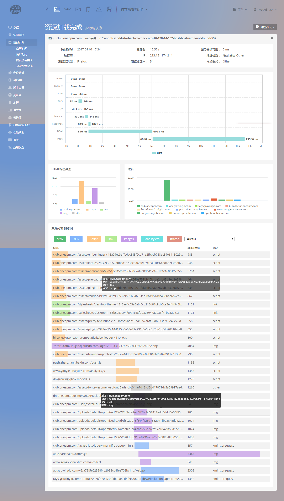
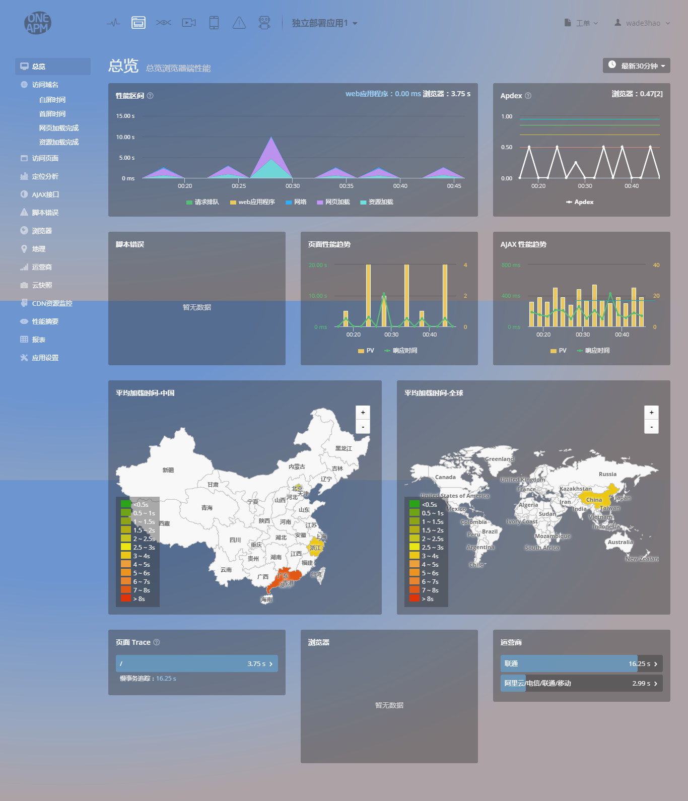
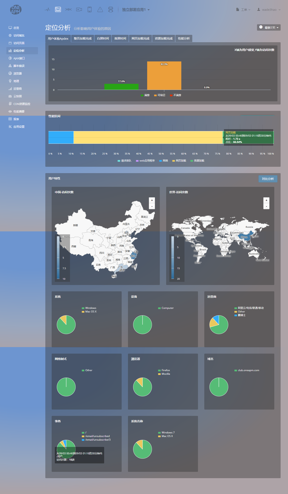
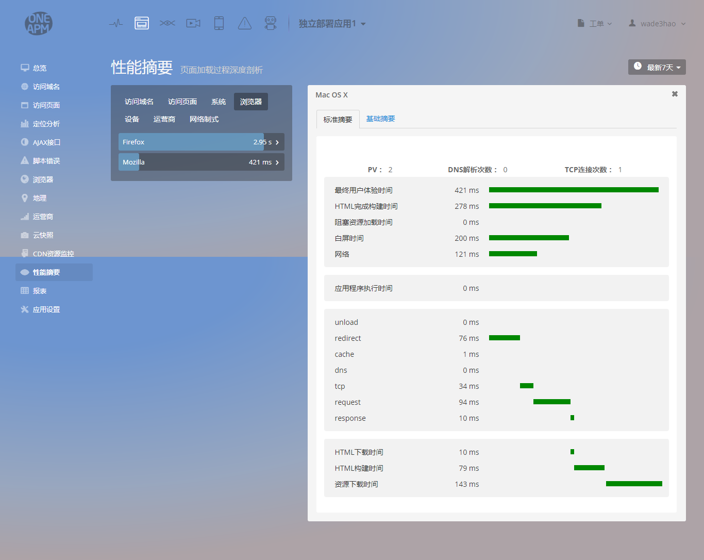
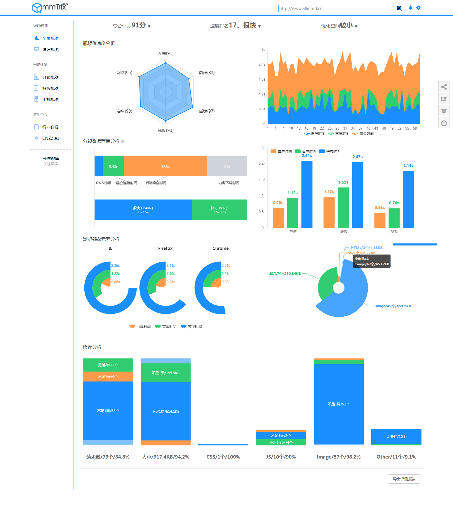
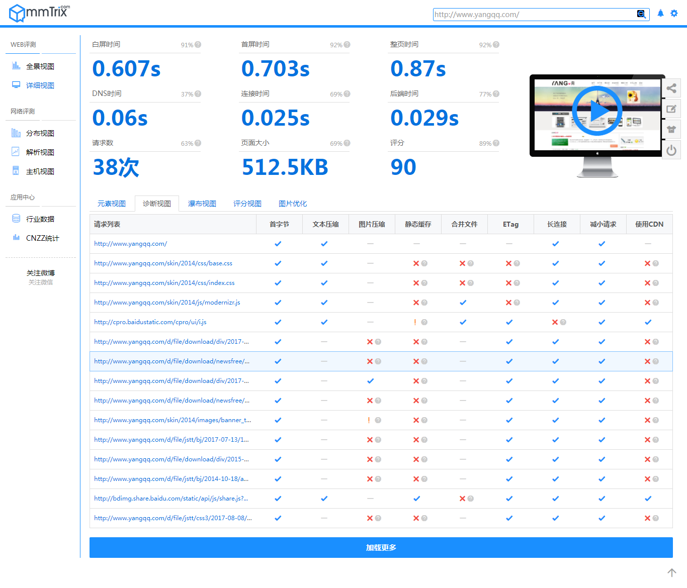
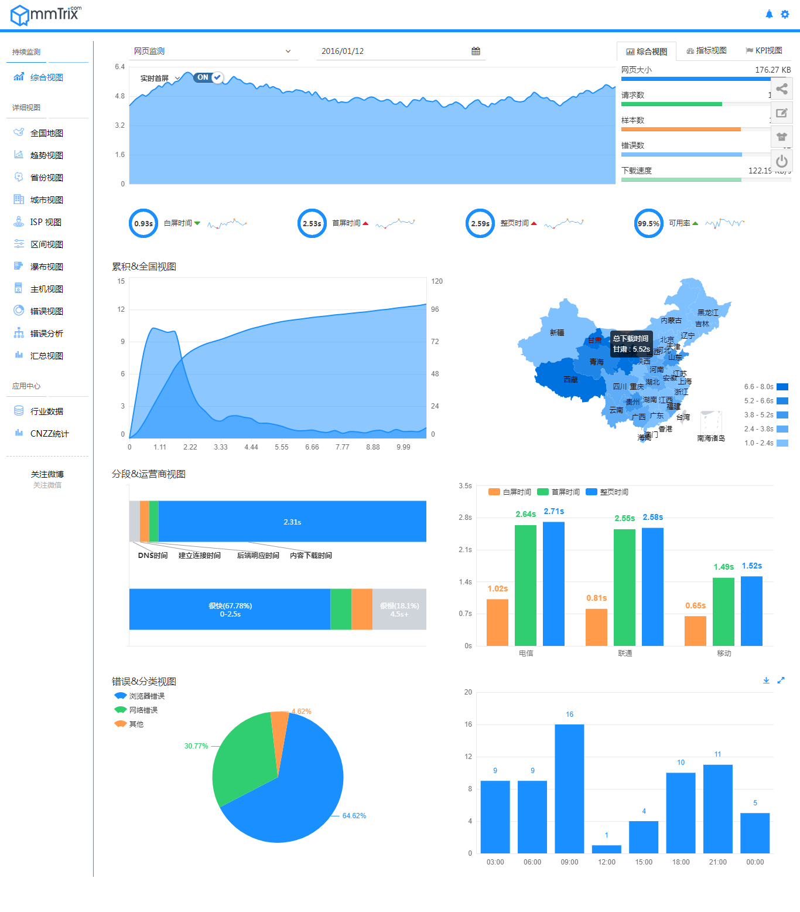
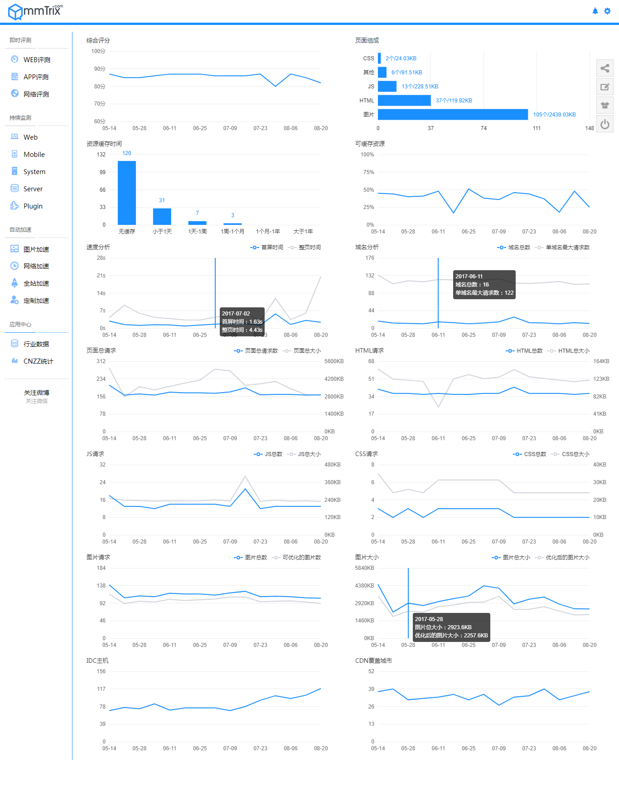

#oneapm

分析结果
- 总览
    1. 用户体验apdex
    4. ajax性能趋势(接口分析)
    5. 平均加载时间(按省事区分,国内国外)
    6. 加载最慢的页面(需要细分的页面)
    7. 浏览器
    8. 运营商
- 定位分析 ** 

- 文档说明
    1. 是否我们设置的10s类似,8s是否更加合适
    >OneAPM 默认当页面的整页时间大于8s，Bi 探针收集页面的Trace信息
    2. 吞吐量
    >ppm指Pages per minute，即为每分钟访问的页数，这是衡量用户访问页面次数的重要参数，是指平均1分钟内访问页面的次数。


## 总览
1. 性能区间
2. apdex  
3. 脚本错误
4. 页面性能趋势
5. ajax性能趋势
6. 平均加载时间(按省事区分,国内国外)
7. [加载最慢的页面](https://rum.oneapm.com/tpm/account/723/browser/2284838/pageviewReady/#/trace/256188/start/1504258496569)

[x轴,y轴如何颠倒]()
>现在echarts3中在yAxis中新增了inverse参数，直接可以倒置Y轴
8. 浏览器
9. 运营商


## 定位分析 **

## ajax接口
## 浏览器
## 地理
## 运营商
## 性能摘要 页面加载过程深度剖析

## 报表 (页面内展示)


### 用户体验 Apdex
性能指数，Apdex(Application Performance Index)是一个国际通用标准，Apdex 是用户对应用性能满意度的量化值。它提供了一个统一的测量和报告用户体验的方法，把最终用户的体验和应用性能作为一个完整的指标进行统一度量
Apdex 定义了 3 个用户满意度区间( OneAPM 默认定义的 T 值为 2 秒)
满意：页面加载时间让用户感到很愉快，页面加载少于 T 秒钟。
容忍：慢了一点，但还可以接受，继续使用应用，页面加载 T～4T 秒
失望：太慢了，受不了了，用户决定放弃这个应用，页面加载超过 4T 秒
Apdex计算公式： Apdex=(满意数 + 容忍数 / 2) / 总样本数

### 吞吐量单位PPM
ppm指Pages per minute，即为每分钟访问的页数，这是衡量用户访问页面次数的重要参数，是指平均1分钟内访问页面的次数。

###常见问题
####Browser Insight 采集那些数据？

Bi 可以采集到的数据包括：页面访问时间（分成四个维度），ajax 性能，js 错误，页面访客浏览器、系统、地点、IP、运营商、页面慢 trace、DNS 耗时、cdn 耗时以及 CDN 资源监控等。
对于所有适配 w3c 接口的浏览器，Bi 都可以采集到响应的数据，可以参考下图了解通过windows.performance 接口我们可以采集哪些时间节点来进行相应的计算


####所有访问的接入方式 Browser Insight 都可以采集到吗？
针对移动端的用户，Bi 可以采集到微信页面、webview页面以及移动端浏览器的页面的访问时间等信息，并支持安卓 4.3 及以上版本的资源加载详情等，并且支持 2G/3G/4G/WiFi 网络支持，由于 ios 系统没有开放相关接口暂不支持。
```
1.HTML5
 Network Information API
 https://w3c.github.io/netinfo/
 // 是否在线
 navigator.onLine
 // 连接类型
 navigator.connection.type
 type: unknown, ethernet, wifi, 2g, 3g, 4g, none.
 // 下行最大比特率 downlinkMax
 navigator.connection.downlinkMax
 // 如果浏览器不支持， 这里有一个 polyfill
 https://github.com/daniellmb/downlinkMax
 2.Server 端配合
 与服务器端配合测试下载一个小图片的速度
 3.Mobile 端配合
 如何有客户端的App，可以配合来测速
```
参考: [oneapm说明文档](https://rum.oneapm.com/tpm/account/723/beacon/applist#/?JSESSIONID=3ef783ee-2caa-468c-839a-a86e2d4dc1bb)

### 性能区间
```
页面加载时间是根据js探针获取一个网页加载过程中的<br>
Navigation start，First byte，DOM ready，Onload
的时间计算的结果。 <br>
请求排队：请求等候服务器处理消耗的时间。<br>
web应用程序：服务器生成网页的消耗的时间。(通过Ai开启Bi功能，会收集Web Application 耗时)<br>
网络：网络连接时间和网页在网络上传输消耗的时间。<br>
网页加载：加载网页到DOM模型建立消耗的时间。<br>
资源加载：网页DOM模型建立到网页渲染结束消耗的时间。
```


# [性能魔方](http://www.mmtrix.com/evaluate/result/testid/3daa7745bb0f13d9ff7847108084d499)

分析结果:

- 全景识图
    1. 评分系统  评分历史 应该是我们需要做的东西,参考一下 
    2. 元素分析   应该是需要考虑performance.getEntries
    3. ip,运营商加入筛选维度
    4. 浏览器分析  数据
    5. 缓存分析
- 实时监控 
- 总体评价
    1. sps,性能,异常
      
      
##全景识图:

###评分类:
```
1. 综合评分
2. 速度排名
3. 优化空间
```
###图形类
```
1. 瓶颈&速度分析
2. 分段&运营商分析    (需求)
3. 浏览器&元素分析
4. 缓存分析
```



##详细视图 (暂不考虑)
>相当于第三方软件线下对于网站的评测
各个时间节点统计


1. 元素视图
2. 诊断视图
3. 瀑布视图
4. 评分视图
5. 图片优化

#实时监控



#总体评价


#报表:(生成pdf)


```text

优化空间描述

>速度维度
分析:整页时间>2s ，延迟1秒的页面加载时间可能导致转换损失7%，减少11%的页面浏览量，并减少16%的客户满意度。如果3秒后，网页还未加载完毕，57%的用户会放弃，74%的用户登录某网站时间超过5秒后就不会再登录这个网站。
建议:减少请求，合并静态文件，统一公用JS/CSS文件，使用CSS Sprites减少图片请求，减少Cookie大小，内联小图片和JavaScript，减少iframe请求，按需加载、异步加载、延迟加载、预加载。

>前端维度
分析:总请求数69，总大小733.39KB，17个JS，49张图片，其中31张图片可被优化，页面复杂度和大小直接影响加载时间和用户体验。如果网页请求越多，图片和流媒体元素数量越多，传输和处理所花的时间就越长。JavaScript数量和使用越多，就需要大量时间执行，第三方组件极大地影响页面加载时间和用户体验。
建议:首屏优先优化，尽可能将JS文件放在底部，图片无损和有损压缩，图片预加载，页面代码压缩，精简代码，异步加载第三方脚本，JS性能优化及避免复杂JS，避免CSS表达式。
1. 系统维度
分析:有67个请求可进行缓存优化，有7个请求可合并，有7个请求可进行cookie优化，有2个请求可进行Gzip优化，有3个请求未启用keep-alive，有5个请求可开启ETag优化，详细请查看深度分析。
建议:设置GZIP压缩，避免重定向，设置长时间缓存、尽量使请求可缓存，适当使用多域名增加并行下载，Cookie隔离，按应用选择合适Web Server及硬件服务器，逻辑层协议合并、并行处理，优化操作系统及内核。

网络维度
分析:白屏时间（DNS+建立连接时间+后端响应）为0.629s，有64个请求未使用CDN。
建议:动静应用分离及使用静、动态CDN加速，多区域IDC和运营商部署，动态内网代理，确保IP库精准、减少跨网解析和访问，使用多线BGP覆盖小运营商。
```


